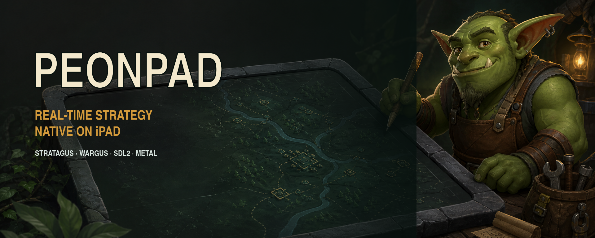
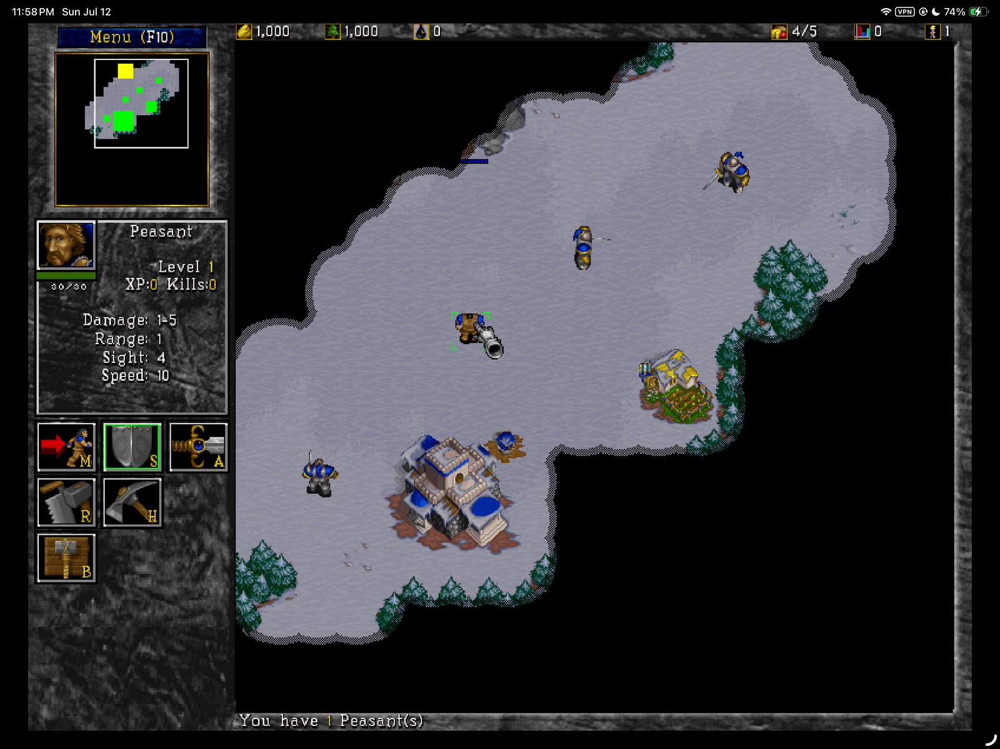
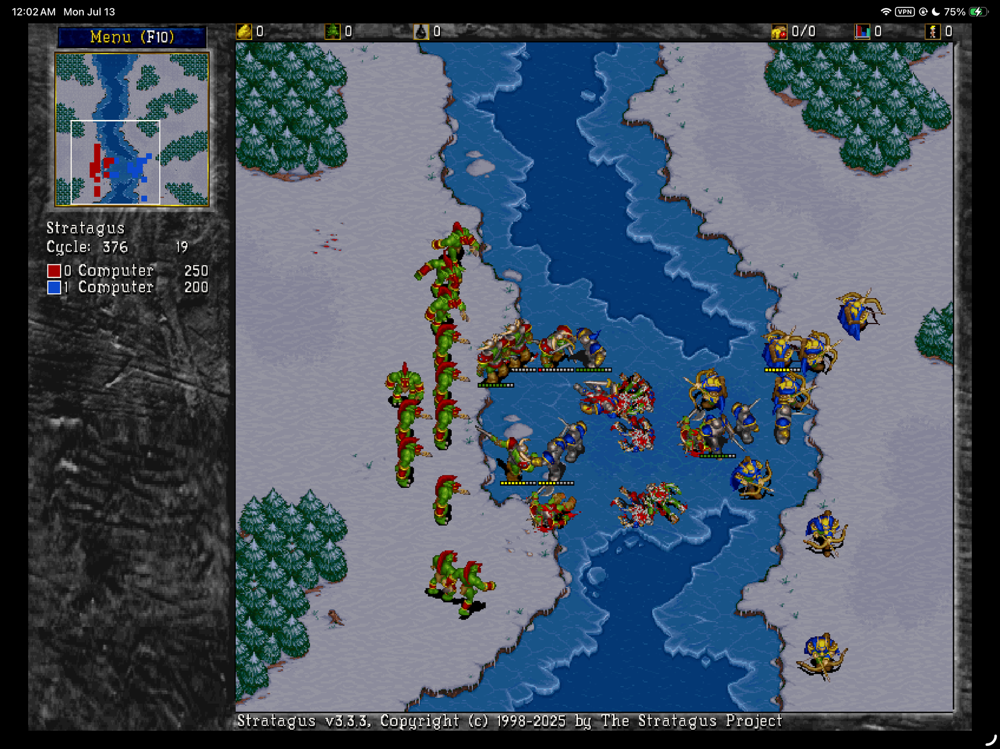
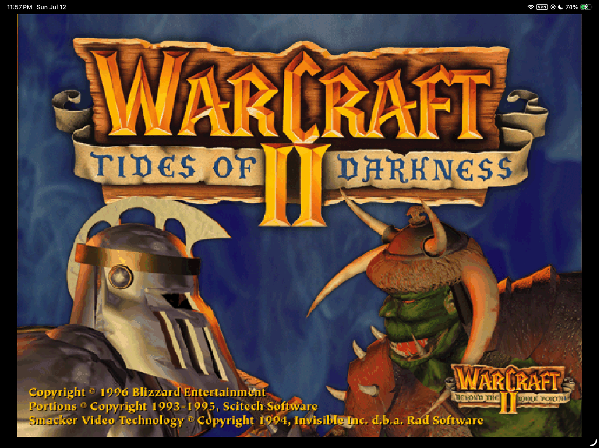

<p align="center">
  
</p>

<p align="center">
  
</p>

<p align="center">
  <a href="LICENSE"></a>
  
  
  
</p>

<p align="center">
  <strong>PeonPad brings the Stratagus/Wargus real-time strategy engine for Warcraft II to iPad as a native ARM64 app.</strong><br>
  SDL2 renders through Metal. Touch gestures map classic RTS actions to the screen. Your game data stays yours.
</p>

<p align="center">
  <a href="#see-it-running">Screenshots</a> ·
  <a href="#what-works-today">Status</a> ·
  <a href="#build-and-run-on-an-ipad">Install</a> ·
  <a href="#touch-controls">Controls</a> ·
  <a href="#project-boundary">Game data</a> ·
  <a href="docs/build-status.md">Engineering log</a>
</p>

> [!IMPORTANT]
> **PeonPad does not include Warcraft II.** To play, you provide data extracted
> from your own legally owned copy on a Mac or PC. That game content stays local
> to your machine and is never part of the PeonPad download.

## What is PeonPad?

PeonPad is an independent Apple-platform Warcraft II port built on the open-source
[Stratagus engine](https://github.com/Wargus/stratagus) and
[Wargus game layer](https://github.com/Wargus/wargus). It runs engine code
directly on iPadOS; it does **not** run a Windows executable, emulate x86, or
stream a game from another computer.

```text
Your legally owned game media
            │
            ▼  extract on desktop with Wargus tooling
    local data.Wargus folder        never tracked by Git
            │
            ▼  private staging copy
    native iPadOS application       ARM64 + SDL2 + Metal
            │
            ▼
        your iPad over USB
```

This repository is currently a **developer preview**. A signed build has been
installed and exercised on a physical M2 iPad Pro, but there is no App Store
release, downloadable IPA, or in-app content importer yet.

## See it running

<table>
  <tr>
    <td width="50%"></td>
    <td width="50%"></td>
  </tr>
  <tr>
    <td align="center"><strong>Touch-ready skirmishes</strong><br><sub>Native UI, fog of war, selection and build commands</sub></td>
    <td align="center"><strong>The full battlefield</strong><br><sub>Large encounters rendered through SDL2 and Metal</sub></td>
  </tr>
</table>

<details>
  <summary><strong>Open the original title-screen capture</strong></summary>
  <br>
  <p align="center"></p>
</details>

<sub>These are user-supplied, in-game captures from a privately built copy using
legally owned game data. They document compatibility; they are not included as
application assets. Warcraft II artwork and marks belong to Blizzard
Entertainment and its licensors.</sub>

## What works today

| Area | State | Evidence |
| --- | :---: | --- |
| Native iPad runtime | ✅ | ARM64 iPadOS binary, SDL2 Metal renderer, landscape safe areas |
| Warcraft II campaigns | ✅ | Original and Beyond the Dark Portal missions launch, render and play |
| Skirmish | ✅ | Classic and Modern modes launch and play |
| Touch input | ✅ | Selection, command chords, empty-ground deselection and camera pan |
| Save/load | ✅ | Manual saves, autosaves and relaunch loading exercised on device |
| Text entry | ✅ | iPad software keyboard appears for save names and network fields |
| Repeated menu cycles | ✅ | Quit-to-menu regression exercised across device sessions |
| Complete-match regression | ⏳ | A full start-to-victory match still needs to be recorded |
| Hardware keyboard/mouse | 🧪 | Native SDL paths are retained; Magic Keyboard acceptance is pending |
| Multiplayer | 🧪 | Engine support exists; local and online play are unverified on iPad |
| Replay playback | ⏸️ | Hidden in the private iPad profile until legacy playback is reliable |
| In-app Files import | 🧭 | Planned; current developer builds stage data on the Mac |

The private Warcraft II profile exposes original campaigns plus Skirmish
Classic and Skirmish Modern. Incompatible legacy custom modes are deliberately
excluded instead of being presented as working. See
[`docs/ipad-test-notes.md`](docs/ipad-test-notes.md) for the regression matrix
and the reasoning behind each product decision.

## Touch controls

PeonPad keeps ordinary taps immediate and adds only the gestures needed to make
a mouse-first RTS playable on glass.

| Gesture | Action |
| --- | --- |
| **One finger** | Point, select, drag-select and activate UI |
| **Tap empty terrain** | Clear the current selection |
| **Two-finger tap** | Right-click command at the **leftmost finger** |
| **Three-finger drag** | Pan the battlefield with a modest 1.35× gain |
| **Hardware pointer/keyboard** | Native SDL input, including modifier keys |

Two-finger movement beyond a small tolerance cancels the command. Adding the
third finger cancels that pending command before camera panning begins. The
gestures are gameplay-only, so menus keep normal iPad behavior.

There is no pinch-to-zoom: the classic Wargus view is fixed-scale. A visible
Shift/Control/Alt modifier dock is designed but not yet implemented.

## Build and run on an iPad

### What you need

- An Apple Silicon Mac with full Xcode installed and first-launch setup complete
- Homebrew, CMake 3.27 or newer, Git and `pkg-config`
- An iPad running iPadOS 16 or newer, a USB cable and Developer Mode
- An Apple ID available to Xcode for a Personal Team development signature
- A legally owned Warcraft II installation or an extracted `data.Wargus`

The accepted device is an M2 iPad Pro on iPadOS 26.5.2. The deployment target
is iPadOS 16.0. Other iPad hardware still requires testing.

Install the public build dependencies once:

```sh
brew install cmake pkg-config
```

The raw-installer route also needs:

```sh
brew install innoextract ffmpeg
```

PeonPad checks for these tools but never installs or upgrades packages for you.

### 1. Clone PeonPad

```sh
git clone https://github.com/chrissotraidis/peonpad.git
cd peonpad
./scripts/preflight.sh
```

The public preflight checks the tracked source snapshots, ignore rules, Xcode,
the iPhoneOS SDK and both compiler probes. It does not require the private
maintainer fixture.

### 2. Prepare the Xcode project

Choose one route. The command builds the host tools, prepares and stages your
game data, and generates `build/ios-xcode/stratagus.xcodeproj`.

**From the validated English GOG installer**

Keep these two original files together in the same directory:

```text
setup_warcraft_ii_2.02_v5_(78104).exe
setup_warcraft_ii_2.02_v5_(78104)-1.bin
```

Then run:

```sh
./scripts/prepare-ipad-build.sh --installer \
  "$HOME/Downloads/setup_warcraft_ii_2.02_v5_(78104).exe"
```

This automated route is pinned to Warcraft II Battle.net Edition 2.02 v5,
English, GOG build 78104. PeonPad verifies both files by SHA-256 before running
`innoextract`, then converts the data with the `wartool` built from this repo.
Other editions are deliberately rejected rather than guessed at.

**From an existing `data.Wargus`**

If Wargus has already extracted your legally owned game, run:

```sh
./scripts/prepare-ipad-build.sh --data "/path/to/data.Wargus"
```

For unsupported installers, use the extraction guidance in the
[Wargus README](https://github.com/Wargus/wargus#extracting-data-for-macos),
then use this `--data` route. PeonPad validates the expected scripts, extraction
marker, graphics, maps and sounds before staging anything.

> [!WARNING]
> Do not copy the original `.exe`, `.bin`, `INSTALL.MPQ`, disc image, or store
> installer into the app bundle. Those files are desktop extraction inputs;
> the iPad does not execute them.

Both routes leave proprietary content only in ignored local directories. The
staging step removes the redundant installer MPQ and incompatible custom modes
without changing the source data.

### 3. Sign and deploy over USB

1. Connect and unlock the iPad, tap **Trust**, and enable Developer Mode if
   iPadOS requests it.
2. Confirm the device appears in `xcrun devicectl list devices`.
3. In **Xcode → Settings → Accounts**, add your Apple ID. Credentials remain in
   Xcode; PeonPad never receives them.
4. Open `build/ios-xcode/stratagus.xcodeproj`.
5. Select the `stratagus` target, choose your Personal Team under **Signing &
   Capabilities**, and use a unique bundle identifier if Xcode requests one.
6. Select the connected iPad and press **Run**.

The result runs directly on the iPad. The Mac is needed to compile and sign the
developer build, not to stream or host gameplay.

> [!TIP]
> This is a source build with CMake, Xcode signing and user-owned game data.
> If that toolchain is unfamiliar, using Codex from the cloned repository is
> recommended: ask it to follow this installation section and diagnose any
> preflight or Xcode error. Keep your installer and `data.Wargus` local; they
> should never be uploaded, committed or pasted into a task.

<details>
  <summary><strong>Manual command breakdown</strong></summary>

```sh
./scripts/preflight.sh
./scripts/build-macos.sh
PEONPAD_WC2_DATA_DIR="/path/to/data.Wargus" \
  ./scripts/stage-ios-wc2-test-data.sh
./scripts/generate-ios-xcode.sh
open build/ios-xcode/stratagus.xcodeproj
```

`generate-ios-xcode.sh` defaults to the staged `build/ios-wc2-data` payload.
The one-command preparation script runs this same sequence and adds installer
extraction when `--installer` is selected.
</details>

<details>
  <summary><strong>Fast macOS development loop</strong></summary>

```sh
./scripts/build-macos.sh
./scripts/smoke-macos.sh
./scripts/run-macos.sh --profile wc2 -- -W
```

These defaults use ignored root-level `data.Wargus`. Pass `--data PATH` to the
runtime command, or `PEONPAD_WC2_DATA_DIR=PATH` to the smoke command, when your
extracted folder lives elsewhere. Runtime state stays under ignored `runtime/`.
</details>

<details>
  <summary><strong>Maintainer reference verification</strong></summary>

```sh
./scripts/preflight.sh --maintainer
./scripts/build-macos.sh --maintainer
./tests/script-guardrails.sh --maintainer
```

This optional mode verifies the private, immutable `ref/` evidence fixture from
the original port. Normal users do not need or have that fixture and should not
create it.
</details>

## Project boundary

The separation between code and content is a feature, not a packaging detail.

### This repository contains

- GPL-licensed Stratagus/Wargus source at revision-locked snapshots
- PeonPad's Apple-platform integration, touch controls and build tooling
- Vendored open-source dependencies and their notices
- Original PeonPad icon, launch artwork and README banner
- Documentation screenshots supplied by the device owner

### This repository does not contain

- Blizzard game executables, installers, MPQs, discs or extracted game data
- Warcraft II art, audio, video or maps as application resources
- A redistributable free-content bundle; Aleona's Tales remains audit-blocked
- Signing identities, provisioning profiles, saves, logs or account secrets

Before every distributable build, PeonPad scans the application bundle for
forbidden proprietary inputs. The repository ignore rules independently block
the same classes of local files. See [`NOTICE`](NOTICE),
[`LICENSES/README.md`](LICENSES/README.md), and
[`docs/aleona-asset-audit.md`](docs/aleona-asset-audit.md).

## Architecture

| Layer | Role |
| --- | --- |
| **Stratagus** | Native RTS simulation, renderer and input loop |
| **Wargus** | Warcraft II-compatible scripts and desktop data tooling |
| **SDL2** | UIKit windowing, events, audio and Metal-backed rendering |
| **PeonPad Apple layer** | Safe areas, Retina coordinates, lifecycle, touch chords and text input |
| **Xcode** | Native iPadOS compilation, Personal Team signing and USB deployment |

The target is currently `TARGETED_DEVICE_FAMILY=2`: **iPad only**. An iPhone is
also ARM64, but PeonPad has not adapted or accepted its UI, safe areas, touch
density, performance or thermal behavior. iPhone support should not be claimed
until those product and device tests exist.

## What GPL-2.0 means

GPL-2.0 is the open-source license for PeonPad's code. In practical terms:

- You may run, study and modify PeonPad for private use.
- You may share PeonPad, including modified versions and commercial builds.
- If you distribute a PeonPad binary or modified version, you must make the
  corresponding source available under GPL-2.0 and preserve the license and
  copyright notices.
- The software is provided without a warranty.

Those permissions apply to PeonPad's GPL-covered source—not to Warcraft II game
data, artwork, audio, video or trademarks. GPL-2.0 cannot grant rights that the
PeonPad project does not own. Read the complete terms in [`LICENSE`](LICENSE).
The [GNU GPL-2.0 page](https://www.gnu.org/licenses/old-licenses/gpl-2.0.html)
also provides the canonical license text and supporting material. This summary
is explanatory, not legal advice.

## Roadmap

- [x] Reproducible native Apple Silicon macOS baseline
- [x] Physical-device iPadOS ARM64 build through SDL2 and Metal
- [x] Campaigns, skirmishes, touch commands, camera pan and software keyboard
- [x] Save/load and repeated quit-to-menu device checks
- [ ] Complete and record a full match regression
- [ ] Add an in-app Files picker and validation for owned `data.Wargus`
- [ ] Ship discoverable Shift/Control/Alt touch modifiers
- [ ] Accept Magic Keyboard, mouse and trackpad combinations on hardware
- [ ] Test local and online multiplayer on iPad
- [ ] Repair or replace replay playback
- [x] Validate the public installer route from an unrelated clean clone
- [ ] Find a redistribution-cleared libre content path

## Contributing

Keep changes narrow, preserve the code/content boundary, and re-run the checks
that cover the surface you touched. The usual gate is:

```sh
./scripts/preflight.sh
./scripts/build-macos.sh
./scripts/smoke-macos.sh
```

iPad changes also require an actual device pass; simulator or compiler success
is not enough. Start with [`docs/build-status.md`](docs/build-status.md) and
[`docs/ipad-test-notes.md`](docs/ipad-test-notes.md), then record new device
evidence rather than replacing it with assumptions.

## License and trademarks

PeonPad source code is distributed under GPL-2.0; dependency and asset notices
live under [`LICENSES/`](LICENSES/). The generated PeonPad banner and project
artwork are original, independent branding. Documentation screenshots are not
game assets and are not offered under PeonPad's source-code license; the game
imagery visible inside them remains the property of its respective rights
holders.

Warcraft, Warcraft II, Battle.net, and Blizzard Entertainment are trademarks
or registered trademarks of Blizzard Entertainment, Inc. All associated game
content belongs to its respective rights holders. PeonPad is not affiliated
with, endorsed by, or sponsored by Blizzard Entertainment. You are responsible
for using your game data in accordance with the license for your copy and the
laws that apply to you.
